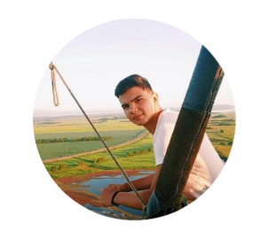

#  Collaborators

## Zarina Alexía Milanesio

  
 

 
 &nbsp;&nbsp;&nbsp;&nbsp;
 
 

 

## Francisco Sponton

  
 

 
 &nbsp;&nbsp;&nbsp;&nbsp;
 
 

  

## Mailin Adaro

  
 

 
 &nbsp;&nbsp;&nbsp;&nbsp;
 
 

  

## Juan Lopez

  
 

 
 &nbsp;&nbsp;&nbsp;&nbsp;
 
 

  

## Ezequiel Sosa

  
 

 
 &nbsp;&nbsp;&nbsp;&nbsp;
 
 

  

